# IndexTTS2 Processing Logic - Mermaid Diagrams

This document provides comprehensive Mermaid diagrams illustrating the processing logic of IndexTTS2, a sophisticated text-to-speech system.

## 1. System Architecture Overview

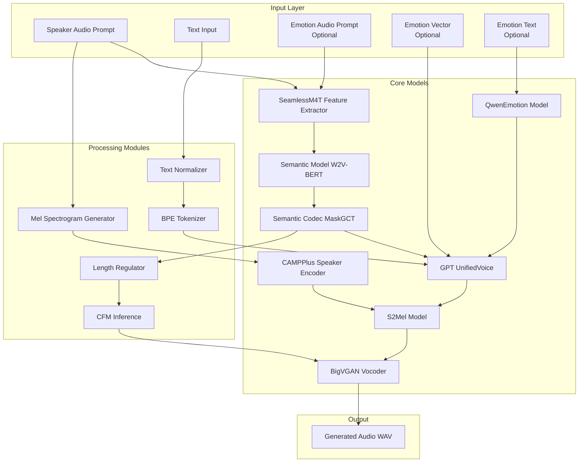

## 2. Initialization Process

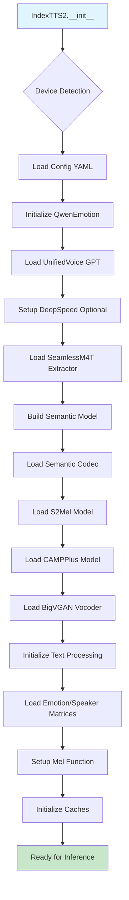

## 3. Main Inference Flow

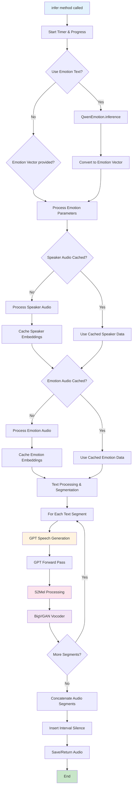

## 4. Audio Processing Pipeline

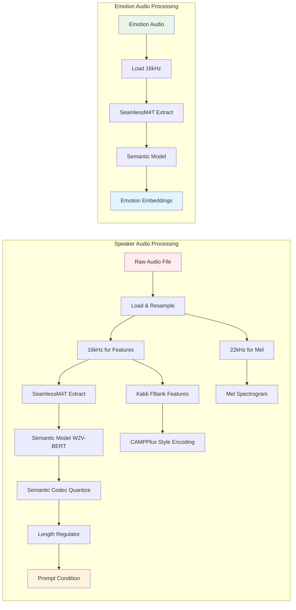

## 5. Text Processing Pipeline

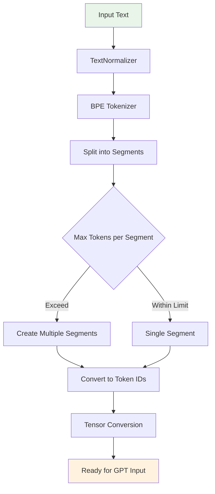

## 6. Emotion Processing System

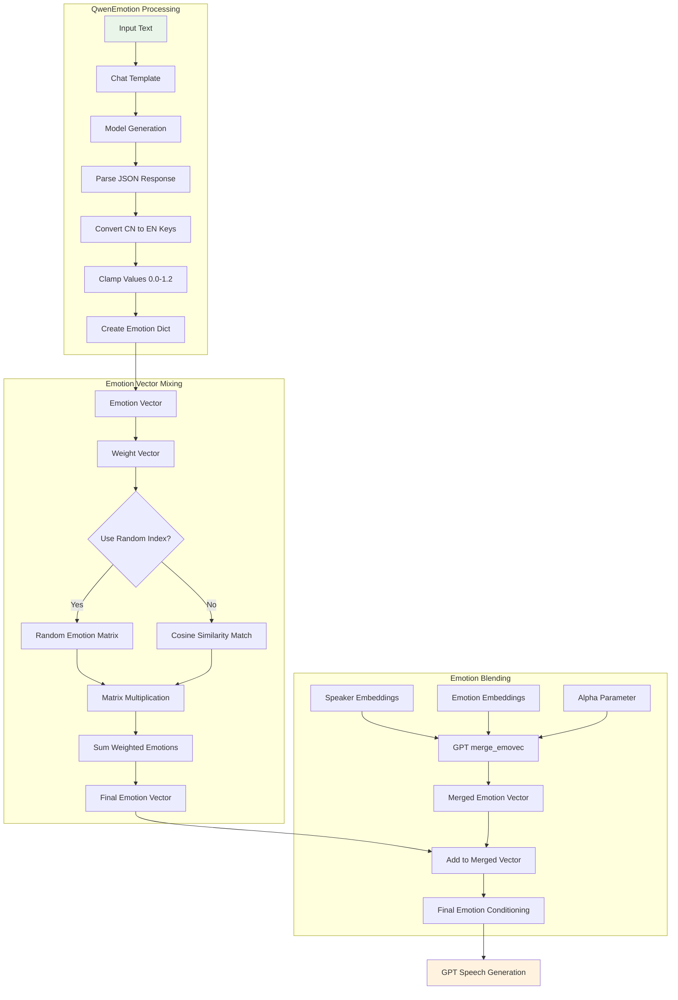

## 7. GPT Speech Generation

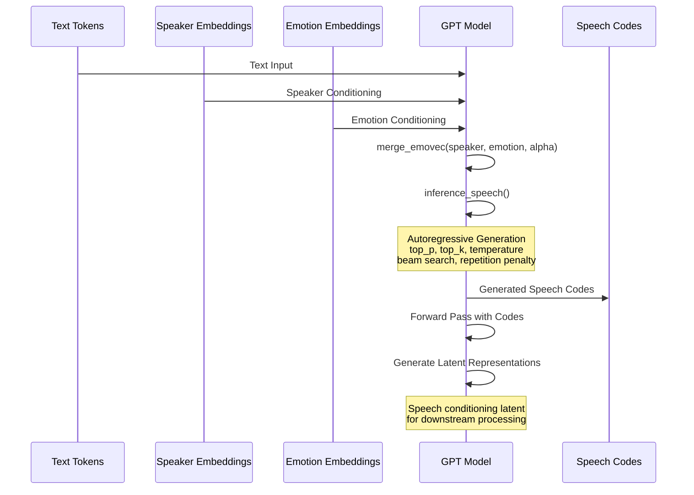

## 8. S2Mel Processing Pipeline

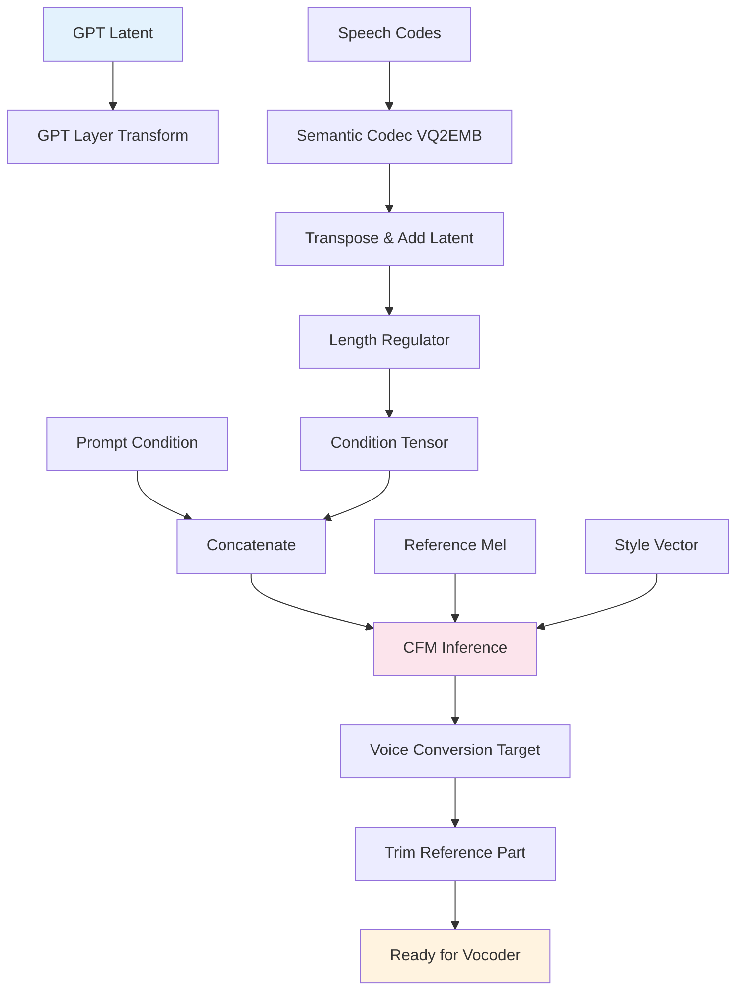

## 9. BigVGAN Vocoder Processing

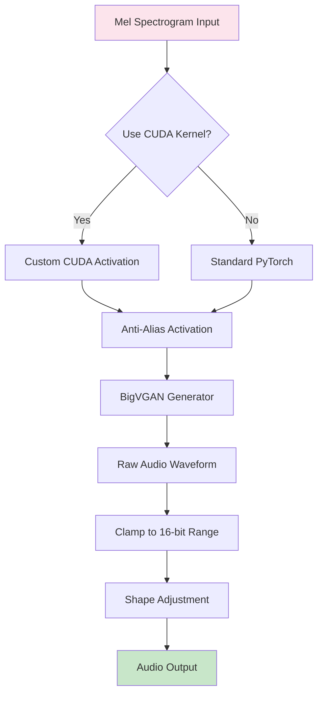

## 10. Caching System

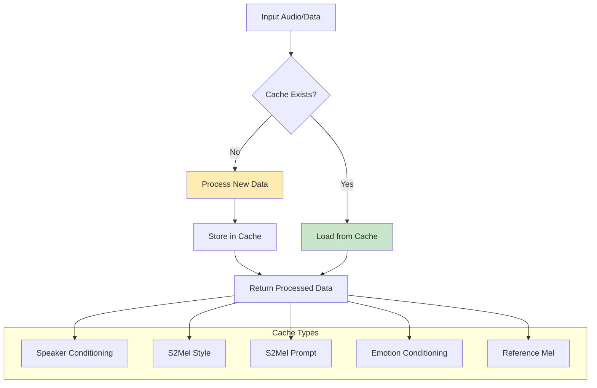

## 11. Complete Data Flow (Detailed)

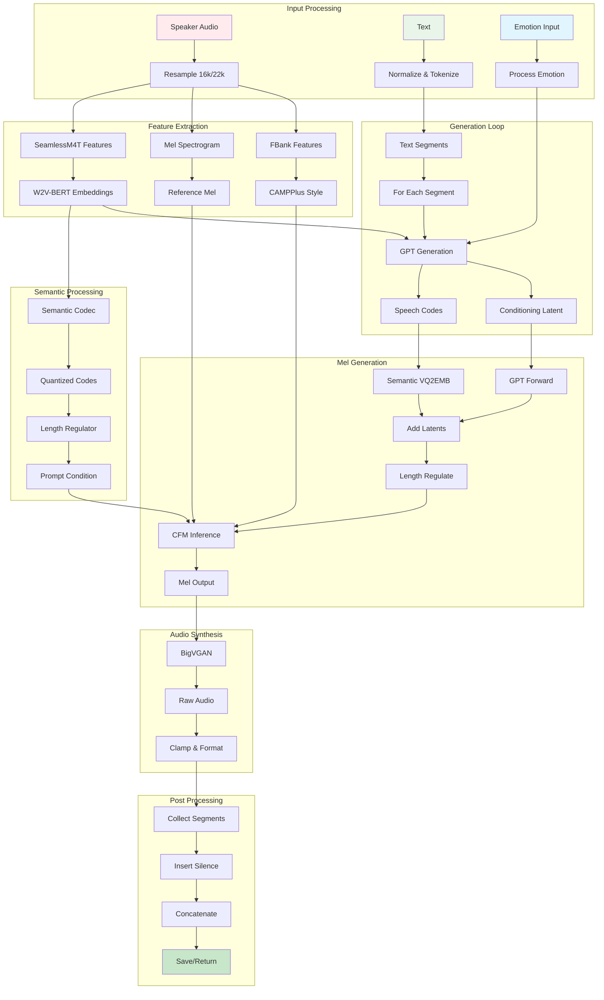

## 12. Error Handling & Optimization

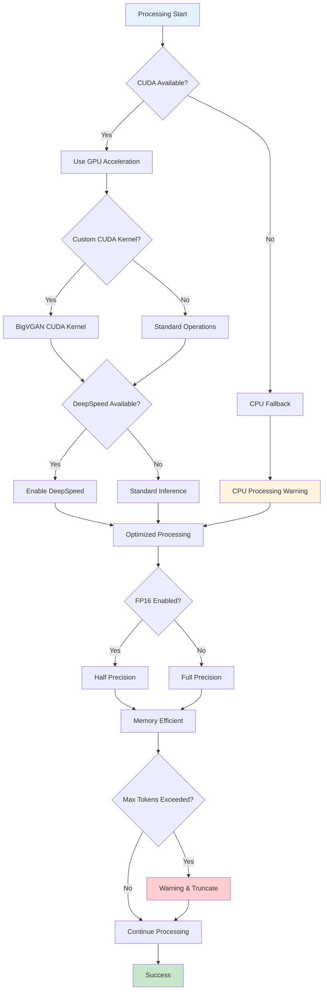

---

## Summary

This documentation provides a comprehensive visual representation of the IndexTTS2 system through Mermaid diagrams. The system follows a sophisticated pipeline:

1. **Input Processing**: Multiple audio and text inputs with emotion control
2. **Feature Extraction**: Advanced semantic and acoustic feature extraction
3. **Generation**: GPT-based autoregressive speech code generation
4. **Synthesis**: Advanced mel-spectrogram generation and neural vocoding
5. **Optimization**: Extensive caching and hardware acceleration support

The system demonstrates state-of-the-art TTS capabilities with fine-grained emotion control, speaker adaptation, and high-quality audio synthesis through the BigVGAN vocoder.